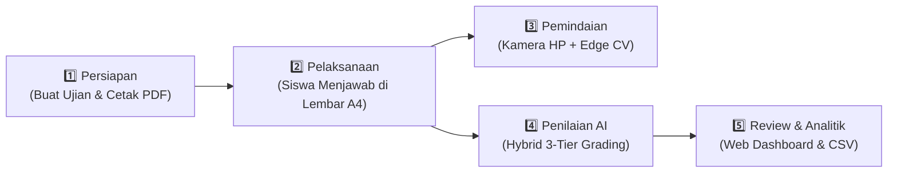
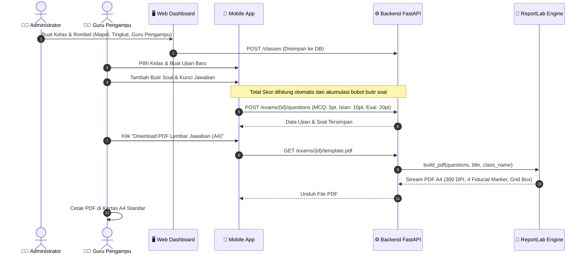
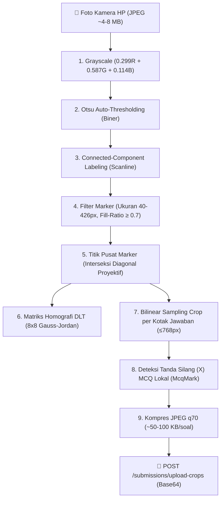
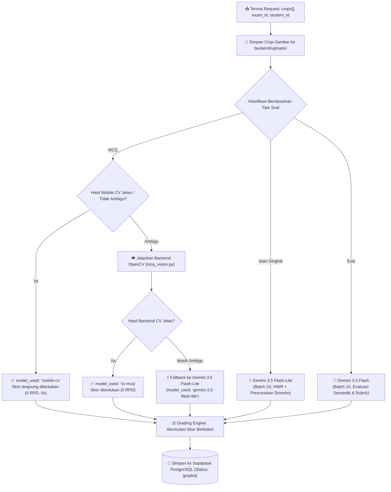

# 🔄 02 — Alur Kerja Sistem End-to-End

Dokumen ini memuat panduan operasional dan alur kerja komprehensif sistem **Vidyanetra** dari tahap pembuatan ujian, pencetakan lembar PDF A4, pemindaian kamera HP, penilaian hybrid AI, hingga pelaporan analitik di web dashboard.

---

## 🧭 Ringkasan 5 Tahapan Alur Kerja

---

## 🟢 TAHAP 1: Persiapan Ujian & Template PDF A4

### Standar Penulisan Kunci Jawaban (`answer_key`):
* **Pilihan Ganda (MCQ):** Pilih opsi benar (`A`, `B`, `C`, atau `D`).
* **Isian Singkat:** Tuliskan kata kunci benar. Tambahkan variasi sinonim/rumus setara menggunakan pemisah pipa `|` (contoh: `fotosintesis | proses pembuatan makanan pada tumbuhan` atau `teorema Pythagoras | a^2+b^2=c^2`).
* **Esai / Uraian:** Tuliskan gagasan utama / rubrik konsep kunci yang wajib dievaluasi secara semantik.

---

## 📝 TAHAP 2: Pelaksanaan Ujian oleh Siswa

1. Siswa mengisi identitas diri (Nama, Kelas, No. Absen, Tanggal) pada bagian kop lembar jawaban A4.
2. **Aturan Pengisian Kotak:**
   * **Pilihan Ganda:** Siswa memberikan **tanda silang (X)** pada salah satu kotak opsi (`a`, `b`, `c`, atau `d`).
   * **Isian & Esai:** Siswa menuliskan teks jawaban menggunakan pulpen/pensil di dalam kotak bernomor.
3. Lembar jawaban dikumpulkan setelah ujian selesai.

---

## 📷 TAHAP 3: Pemindaian Kamera & Edge Computer Vision (Mobile)

Seluruh deteksi geometris dan pemotongan gambar dilakukan **secara lokal di HP Android (Pure Dart)** tanpa mengunggah foto utuh ke server:

---

## 🧠 TAHAP 4: Penilaian Hybrid & Koreksi AI (Backend)

Backend menerima muatan crop jawaban dan mengevaluasi hasil secara paralel:

---

## 📊 TAHAP 5: Review, Finalisasi & Analitik Asesmen (Web)

1. **Review & Manual Override:**
   * Guru membuka antarmuka *Split-View* di Web Dashboard (`/dashboard/exams/[id]/students/[sid]`).
   * Menampilkan gambar potongan crop tulisan siswa, transkripsi HWR AI, alasan evaluasi, dan model penilai.
   * Guru dapat mengubah nilai per butir soal (*manual override*) menggunakan slider nilai tanpa re-grading AI.
2. **Finalisasi Nilai:**
   * Guru menekan tombol **Finalize** untuk mengunci nilai siswa.
3. **Analitik Asesmen di Web Dashboard:**
   * **4 Kartu KPI:** Rata-rata kelas, tingkat ketuntasan KKM ($\ge 70\%$), nilai tertinggi, nilai terendah.
   * **Distribusi Nilai:** Histogram sebaran perolehan nilai siswa (10 bucket interval).
   * **Analisis Kesukaran Soal (Traffic Light):** 🟢 Mudah $\ge 80\%$, 🟡 Sedang $40\text{--}79\%$, 🔴 Sukar $< 40\%$.
   * **Ekspor Laporan:** Unduh rekap nilai format CSV siap pakai untuk e-Rapor sekolah.
