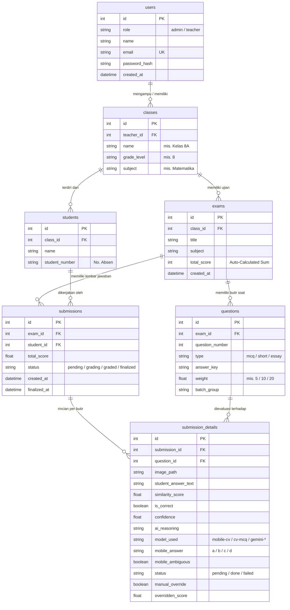

# 🌐 03 — Spesifikasi API Backend & Skema Database

Dokumen ini memuat kontrak REST API FastAPI lengkap serta definisi skema database relasional SQLAlchemy 2.0 yang digunakan pada sistem **Vidyanetra**.

---

## 🗄️ 1. Diagram Relasi Entitas (ERD)



---

## 🔐 2. Autentikasi & RBAC Controller

Header Wajib (kecuali endpoint publik): `Authorization: Bearer <access_token>`

### `POST /auth/login` (Publik)
* **Request:** `{"email": "guru@sekolah.id", "password": "rahasia123"}`
* **Response `200 OK`:**
  ```json
  {
    "access_token": "eyJhbGciOi...",
    "token_type": "bearer",
    "user": {
      "id": 1,
      "role": "teacher",
      "name": "Budi Raharjo",
      "email": "guru@sekolah.id"
    }
  }
  ```

### `GET /auth/me`
* **Deskripsi:** Mengambil profil pengguna yang sedang login.

### Manajemen Pengguna (`/users` — Admin Only)
* `GET /users`: Mengambil daftar pengguna + `classes_count`.
* `POST /users`: Membuat akun baru (Admin / Guru) dengan hashing bcrypt.
* `PUT /users/{id}`: Mengubah profil atau peran.
* `DELETE /users/{id}`: Menghapus akun pengguna (dilindungi proteksi *self-delete prevention*).

---

## 🏫 3. Manajemen Kelas & Siswa

### Kelas / Rombel (`/classes`)
* `GET /classes`: Admin melihat seluruh kelas; Guru melihat kelas yang diampunya. Item memuat `teacher_name`, `students_count`, dan `exams_count`.
* `POST /classes`: Membuat kelas baru (`name`, `grade_level`, `subject`, `teacher_id`).
* `PUT /classes/{id}`: Mengubah nama kelas, tingkat, mata pelajaran, atau penugasan guru.
* `DELETE /classes/{id}`: Menghapus kelas (*Cascade Delete* ke siswa, ujian, dan riwayat penilaian).

### Roster Siswa (`/students`)
* `GET /classes/{class_id}/students`: Daftar siswa terurut nomor absen.
* `POST /classes/{class_id}/students`: Tambah 1 siswa (`name`, `student_number`).
* `POST /classes/{class_id}/students/bulk`: Impor massal siswa via array JSON:
  ```json
  [
    {"student_number": "01", "name": "Aditya Pratama"},
    {"student_number": "02", "name": "Budi Santoso"}
  ]
  ```
* `PUT /students/{id}`: Ubah nama atau nomor absen siswa.
* `DELETE /students/{id}`: Hapus data siswa.

---

## 📝 4. Manajemen Ujian & Butir Soal

### Ujian (`/exams`)
* `GET /exams`: Daftar ujian (filter opsional `?class_id=X`). Memuat `class_name`, `submissions_count`, `finalized_count`, `total_students`, dan `average_score`.
* `POST /exams`: Membuat ujian baru (`class_id`, `title`, `subject`, `total_score` [default: 0]).
* `GET /exams/{id}`: Detail ujian beserta butir soal.
* `GET /exams/{id}/submissions`: Daftar lembar jawaban siswa pada ujian terkait.
* `GET /exams/{id}/template.pdf`: Streaming **PDF Lembar Jawaban A4 (300 DPI)** siap cetak.
* `GET /exams/{id}/export.csv`: Ekspor rekapitulasi nilai lengkap format CSV.
* `DELETE /exams/{id}`: Hapus ujian beserta butir soal dan riwayat jawaban.

### Butir Soal (`/questions`)
* `POST /exams/{id}/questions`: Tambah butir soal (otomatis memperbarui total skor ujian $\sum \text{weight}$):
  ```json
  {
    "question_number": 1,
    "type": "mcq", // "mcq" (default weight 5) | "short" (10) | "essay" (20)
    "answer_key": "A",
    "weight": 5.0
  }
  ```
* `PUT /questions/{id}`: Perbarui tipe soal, kunci jawaban, atau bobot nilai.
* `DELETE /questions/{id}`: Hapus butir soal.

---

## 📥 5. Pengunggahan Crop Jawaban & Penilaian AI

### `POST /submissions/upload-crops`
* **Deskripsi:** Menerima kiriman potongan gambar jawaban dari aplikasi mobile dan memicu evaluasi grading di background (`BackgroundTasks`).
* **Batasan Payload:** Maksimal 5 MB per request.
* **Payload:**
  ```json
  {
    "exam_id": 1,
    "student_id": 5,
    "crops": [
      {
        "question_number": 1,
        "image_base64": "/9j/4AAQSkZJRgABAQAAAQABAAD/2wBDA...",
        "mcq_answer": "b",
        "mcq_ambiguous": false
      }
    ]
  }
  ```
* **Response `202 Accepted`:** `{"id": 12, "exam_id": 1, "student_id": 5, "status": "pending"}`

### `GET /submissions/{id}/details`
* **Deskripsi:** Mengambil status penilaian lengkap beserta detail evaluasi per butir soal:
  ```json
  {
    "id": 12,
    "exam_id": 1,
    "student_id": 5,
    "student_name": "Aditya Pratama",
    "status": "graded",
    "total_score": 85.0,
    "details": [
      {
        "id": 101,
        "question_id": 1,
        "question_number": 1,
        "type": "mcq",
        "image_url": "/uploads/sub_12/q1_a1b2c3d4.jpg",
        "student_answer_text": "b",
        "similarity_score": 100.0,
        "is_correct": true,
        "confidence": 0.98,
        "ai_reasoning": "Deteksi tanda X di aplikasi (tier-1 mobile, CV lokal).",
        "status": "done",
        "model_used": "mobile-cv",
        "mobile_answer": "b",
        "manual_override": false,
        "overridden_score": null
      }
    ]
  }
  ```

### `PUT /submissions/{id}/review`
* **Deskripsi:** Melakukan intervensi guru / pengubahan nilai manual (*manual override*):
  ```json
  {
    "items": [
      { "question_id": 1, "overridden_score": 90.0 }
    ]
  }
  ```

### `POST /submissions/{id}/retry-failed`
* **Deskripsi:** Mengulang evaluasi AI hanya untuk butir soal yang berstatus `failed`.

### `POST /submissions/{id}/finalize`
* **Deskripsi:** Mengunci hasil penilaian siswa dan menghitung skor akhir terbobot.

---

## 📊 6. Endpoint Analitik Asesmen

| Method | Endpoint | Deskripsi |
|---|---|---|
| `GET` | `/analytics/overview` | Ringkasan global: `total_exams`, `total_classes`, `total_students`, `overall_pass_rate`, `pending_submissions_count`, `recent_submissions_count`. |
| `GET` | `/analytics/exams/{id}/distribution` | Histogram distribusi nilai siswa (10 bucket: `0-9`, $\dots$, `90-100`). |
| `GET` | `/analytics/exams/{id}/question-difficulty` | Analisis psikometrik butir soal (bobot, percobaan, dan rata-rata skor per nomor). |
