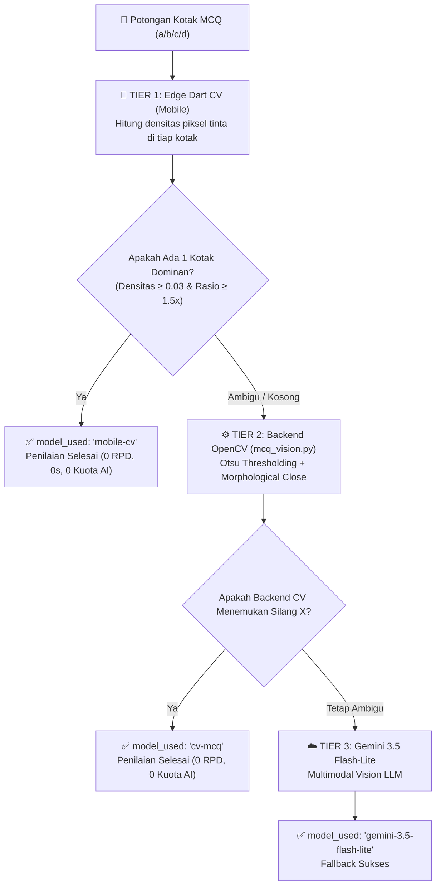

# 🤖 04 — Integrasi Multimodal AI & Computer Vision

Dokumen ini menjelaskan arsitektur penilaian hybrid yang menggabungkan **Edge Computer Vision**, **Backend OpenCV**, dan **Google Gemini Multimodal AI (SDK `google.genai`)**.

---

## 🎯 1. Arsitektur Penilaian Hybrid 3-Tier (Pilihan Ganda / MCQ)

Untuk mengoptimalkan latensi, biaya, dan kuota API Google AI Studio ($200\text{ RPD}$ / $30\text{ RPM}$), soal Pilihan Ganda dievaluasi secara berjenjang (*3-Tier Evaluation Chain*):



### Kriteria Ambigu & Ambang Batas (*Threshold*):
* **Densitas Minimum:** Kotak dengan persentase piksel tinta $< 3\%$ dianggap kosong.
* **Rasio Kontras Pilihan:** Kotak pilihan terbanyak harus memiliki densitas minimal $1.5\times$ lebih pekat daripada pilihan terbanyak kedua. Jika rasio $< 1.5$, tanda silang dianggap ambigu dan diteruskan ke tier berikutnya.

---

## ⚡ 2. Routing Model AI & Interleaved Multimodal Batching

### Pemetaan Model Per Tugas
* **Isian Singkat:** `gemini-3.5-flash-lite` (Batch 10 item/request). Cepat mengekstraksi teks tulisan tangan (*HWR*) dan mencocokkan kemiripan semantik terhadap daftar sinonim kunci.
* **Esai / Uraian:** `gemini-3.5-flash` (Batch 10 item/request). Memiliki kapasitas penalaran kontekstual mendalam untuk mengevaluasi pemahaman konsep dan memberikan alasan penilaian (*ai_reasoning*).
* **Fallback Otomatis:** Jika model `flash` mengalami HTTP `429 Too Many Requests`, sistem otomatis mengalihkan evaluasi ke `gemini-3.5-flash-lite`.

### Interleaved Multimodal Batching
Backend menggabungkan beberapa gambar crop ke dalam **1 request API tunggal** untuk mematuhi batas RPM:
```
Parts: [
  Image_1, Text("Soal 1. Kunci: A"),
  Image_2, Text("Soal 2. Kunci: Fotosintesis"),
  Image_3, Text("Soal 3. Kunci: Hukum Newton I"),
  ...,
  Text("Evaluasi seluruh gambar di atas dan kembalikan array JSON terstruktur.")
]
```

---

## 📝 3. Prompt Template & Strict JSON Schema

### Template Soal Isian Singkat
```
Gambar ke-N berisi tulisan tangan siswa untuk soal isian singkat.
Kunci jawaban: "<answer_key>" (Alternatif jawaban benar dipisahkan tanda '|').

Instruksi Penilaian:
1. Ekstraksi teks yang ditulis siswa apa adanya ke dalam 'extracted_text'.
2. Berikan 'similarity_score' (0 - 100) berdasarkan kesamaan makna terhadap salah satu kunci jawaban alternatif (rumus setara dengan konsep).
3. Berikan 'is_correct' = true jika similarity_score >= 70, false jika sebaliknya.
```

### Template Soal Esai / Uraian
```
Gambar ke-N berisi jawaban esai tulisan tangan siswa.
Rubrik / Konsep Inti Kunci Jawaban: "<answer_key>"

Instruksi Penilaian:
1. Ekstraksi seluruh kalimat jawaban siswa ke dalam 'extracted_text'.
2. Berikan 'similarity_score' (0 - 100) berdasarkan pemahaman konsep dan substansi gagasan (bukan kesamaan kata per kata). Berikan skor parsial jika konsep terjawab sebagian.
3. Tuliskan 'reason' (1-2 kalimat) yang menjelaskan kekuatan atau kekurangan jawaban siswa.
4. Berikan 'is_correct' = true jika similarity_score >= 70.
```

### JSON Schema Output (`response_schema`)
```json
{
  "type": "ARRAY",
  "items": {
    "type": "OBJECT",
    "properties": {
      "question_number": { "type": "INTEGER" },
      "extracted_text": { "type": "STRING" },
      "similarity_score": { "type": "NUMBER" },
      "is_correct": { "type": "BOOLEAN" },
      "confidence": { "type": "NUMBER" },
      "reason": { "type": "STRING" }
    },
    "required": ["question_number", "extracted_text", "similarity_score", "is_correct"]
  }
}
```

---

## ⚖️ 4. Formula Akumulasi Skor Akhir (`GradingService`)

$$\text{Nilai Butir}_i = \begin{cases} \text{overridden\_score}_i & \text{jika } \text{manual\_override} = \text{true} \\ \text{similarity\_score}_i & \text{jika } \text{manual\_override} = \text{false} \end{cases}$$

$$\text{Skor Akhir Siswa} = \frac{\sum_{i=1}^{N} \left( \text{Nilai Butir}_i \times \text{weight}_i \right)}{\sum_{i=1}^{N} \text{weight}_i} \times \frac{\text{Total Skor Ujian}}{100}$$

---

## 🔒 5. Thread-Safety `BatchItem` & Offline Mock Mode

* **Isolasi Thread-Safety:** Sebelum dikirim ke `ThreadPoolExecutor`, seluruh objek ORM disalin ke dataclass murni `BatchItem`, mencegah konflik *lazy-loading* pada session database concurrent.
* **Mode Offline Dev (`MockGeminiClient`):** Aktif saat `GEMINI_MOCK_MODE=true` atau API Key kosong, mengembalikan skor deterministik (85.0/45.0) untuk pengujian lokal tanpa biaya kuota.
