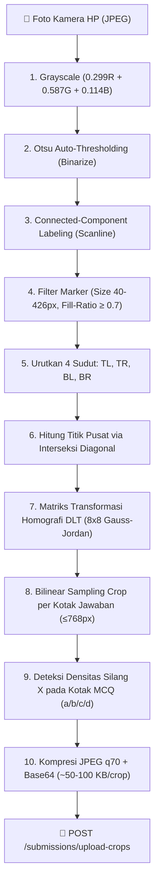

# 📱 06 — Spesifikasi Aplikasi Mobile Scanner (Flutter Android)

Dokumen ini mendokumentasikan arsitektur aplikasi mobile Android **Vidyanetra Scanner**, pipeline pemrosesan citra *Edge Pure Dart*, dan alur kerja pengguna (*UI Workflow*).

---

## 🏗️ 1. Arsitektur & Struktur Direktori

Aplikasi dibangun menggunakan **Flutter 3 (Android API 24+, compileSdk 37)**:

```
mobile/
├── lib/
│   ├── main.dart                    # Entry point, routing, auth guard
│   ├── core/
│   │   ├── api_client.dart          # HTTP client (Dio), JWT auth, interceptor
│   │   ├── config.dart              # Konfigurasi runtime (API_BASE)
│   │   ├── template_constants.dart  # Geometri LJK & koordinat marker A4
│   │   └── opencv_pipeline.dart     # Pipeline Edge CV murni Dart (Pure Dart)
│   └── features/
│       ├── auth/login_page.dart     # Form login guru & konfigurasi server
│       ├── classes/classes_page.dart # Daftar kelas yang diampu guru
│       ├── exams/exams_page.dart    # Daftar ujian aktif & progres koreksi
│       ├── exams/exam_editor_page.dart # Exam & Question builder berbobot otomatis
│       ├── scanning/scan_page.dart  # Kamera scanner, multi-page, crop upload
│       └── review/review_page.dart  # In-app review, manual override, finalize
```

---

## ⚡ 2. Pipeline Pemrosesan Citra Edge (Pure Dart)

Untuk menjaga kompatibilitas jangka panjang tanpa ketergantungan library C++ native yang rentan rusak, seluruh algoritma Computer Vision ditulis dalam **Dart murni (`package:image`)**:



### Deteksi Opsi Silang Lokal (`McqMark`):
```dart
class McqMark {
  final String answer;     // Opsi terdeteksi: "a", "b", "c", atau "d"
  final double confidence; // Densitas piksel tinta pada kotak terpilih
  final bool ambiguous;    // True jika densitas < 0.03 atau kontras < 1.5x
}
```
* **Kompensasi Perspektif:** Algoritma membaca fraksi koordinat kotak tetap (`MCQ_BOX_FRACTIONS`) langsung dari citra cell yang telah di-warp.
* **Handover Cerdas:** Nilai `answer` dan `ambiguous` dikirim dalam payload `UploadCropsRequest` sehingga backend langsung menetapkan nilai jika hasil deteksi silang HP sudah pasti.

---

## ✍️ 3. Antarmuka Pengguna & Fitur Aplikasi Mobile

### 1. Dashboard Pengajar & Aksi Cepat
* **Kartu Profil Guru:** Menampilkan inisial, nama, email, status pengajar aktif dengan tema visual Teal-Emerald (`#0F766E` ke `#14B8A6`).
* **Aksi Cepat (Quick Actions):**
  - **Scan Ujian:** Membuka bottom sheet daftar ujian aktif lengkap dengan Nama Ujian, Badge Kelas (`🏫`), Badge Mata Pelajaran (`📚`), dan total bobot soal.
  - **Buat Ujian:** Navigasi cepat ke editor penyusunan ujian.
  - **Analitik:** Melihat statistik capaian dan sebaran nilai siswa.
* **Manajemen Kelas:** Bersifat *read-only* bagi guru. Pembuatan rombel dan penugasan kelas dikelola terpusat oleh Administrator melalui Web Dashboard.

### 2. Form "Buat Ujian Baru" (`exam_editor_page.dart`)
* **Informasi Ujian Sederhana:** Guru memilih penugasan kelas melalui dropdown `"Pilih Kelas"`. Mata pelajaran otomatis disesuaikan dengan penugasan rombel.
* **Default Bobot Standar:**
  - 🔘 **Pilihan Ganda (MCQ):** Default = **`5` pt**
  - ✏️ **Isian Singkat (Short Answer):** Default = **`10` pt**
  - 📄 **Esai / Uraian (Essay):** Default = **`20` pt**
* **Akumulasi Real-time:** Banner aplikasi menampilkan total skor secara otomatis (`Total Skor: X pt`).
* **Download PDF Instan:** Tombol langsung mengunduh lembar jawaban A4 dari backend.

### 3. Kamera Pemindai Lembar Jawaban (`scan_page.dart`)
* **Judul AppBar:** `"Scan LJK"`
* **Panduan Framing Cerdas:** Viewfinder dilengkapi pill semi-transparan berpesan *"Pastikan 4 kotak hitam di sudut lembar masuk bingkai"*, indikator halaman aktif, dan garis laser pemindai animasi.
* **Multi-Page Support:** Tab pilihan halaman (`Hal 1`, `Hal 2`, dst.) dengan status crop tersimpan per halaman.

---

## 📦 4. Kompilasi & Build APK Android (Release Mode)

| Mode Build | Perintah Kompilasi | Ukuran File | Kegunaan |
|---|---|:---:|---|
| **Release Split-ABI (Direkomendasikan ⭐)** | `flutter build apk --release --split-per-abi --dart-define=API_BASE=https://...` | **~18 MB** | Distribusi produksi HP Android modern (`arm64-v8a`). |
| **Release Universal** | `flutter build apk --release --dart-define=API_BASE=https://...` | **~45 MB** | 1 File APK universal untuk semua tipe arsitektur CPU. |

### Perintah Kompilasi Produksi:
```powershell
cd mobile
flutter build apk --release --split-per-abi --dart-define=API_BASE=https://autograding-api.onrender.com
```
*File output:* `mobile/build/app/outputs/flutter-apk/app-arm64-v8a-release.apk` (**~18 MB**), atau `mobile/build/app/outputs/flutter-apk/app-release.apk` (**~45 MB**).
