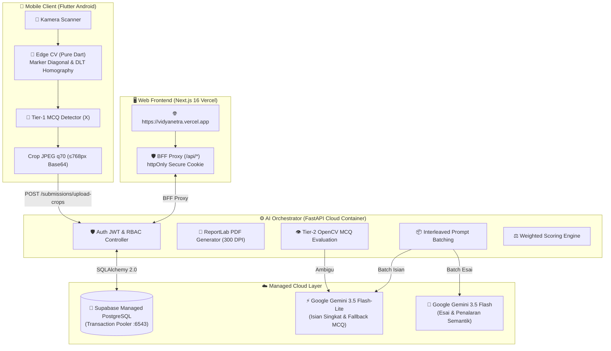

# 📚 Dokumentasi Resmi — Vidyanetra System (Modern Cloud E2E)
### *Sistem Asesmen & Koreksi Ujian Otomatis (Edge CV + Multimodal AI)*

🌐 **Live Web Dashboard:** [https://vidyanetra.vercel.app](https://vidyanetra.vercel.app)

Selamat datang di repositori dokumentasi resmi sistem **Vidyanetra**. Sistem ini menggabungkan teknologi **Edge Computer Vision (Pure Dart)** pada perangkat mobile Android, **Backend API Orchestrator (FastAPI Container)**, **Multimodal AI (Google Gemini 3.5)**, dan **Web Dashboard Analitik (Next.js 16 Vercel)** untuk menyediakan solusi koreksi lembar jawaban ujian tulisan tangan secara akurat, cepat, hemat kuota, dan 100% *cloud-ready*.

---

## 🧭 Peta & Struktur Dokumentasi (`docs-new`)

Dokumentasi ini dirancang secara ringkas, modular, bebas redundansi, dan sepenuhnya berorientasi pada arsitektur produksi modern (tanpa konfigurasi lokal/legacy):

| No | Dokumen | Fokus & Deskripsi Modul |
|:---:|---|---|
| **01** | [**Arsitektur & Desain Sistem**](01-arsitektur-dan-desain-sistem.md) | Topologi Global Cloud 3-Tier, prinsip keamanan *zero-leakage* BFF, routing cerdas AI, dan optimasi *payload*. |
| **02** | [**Alur Kerja End-to-End**](02-alur-kerja-end-to-end.md) | 5 Siklus operasional sistem dari pembuatan ujian berbobot dinamis hingga publikasi nilai dan ekspor e-Rapor. |
| **03** | [**Spesifikasi API & Database**](03-spesifikasi-api-dan-database.md) | Kontrak REST API FastAPI lengkap, diagram ERD, skema tabel SQLAlchemy 2.0, relasi *cascade*, dan RBAC. |
| **04** | [**Integrasi Gemini AI & Computer Vision**](04-integrasi-ai-gemini-dan-cv.md) | Pipeline evaluasi hybrid 3-tier MCQ ($0\text{ RPD}$), *interleaved multimodal batching*, prompt engineering, dan formula *weighted scoring*. |
| **05** | [**Geometri Lembar Jawaban (A4 PDF)**](05-geometri-lembar-jawaban-a4.md) | Spesifikasi PDF A4 300 DPI, deteksi 4 *fiducial marker* proyektif, homografi DLT, dan kontrak koordinat `layout.json`. |
| **06** | [**Aplikasi Mobile Scanner (Flutter)**](06-aplikasi-mobile-scanner.md) | Arsitektur Flutter 3 Android, pemrosesan citra *Pure Dart*, deteksi tanda silang lokal (`McqMark`), dan build APK Split-ABI (~18 MB). |
| **07** | [**Web Dashboard & Analitik (Next.js)**](07-web-dashboard-analitik.md) | Dashboard Next.js 16 Vercel, BFF proxy cookie, analitik psikometrik *traffic light*, triase status, dan review *split-view*. |
| **08** | [**Panduan Deployment Cloud Produksi**](08-deployment-cloud-produksi.md) | Panduan deployment 100% Free Tier (Supabase PostgreSQL + Render/Koyeb Container + Vercel) dan optimasi anti N+1 query. |

---

## 🏛️ Topologi Global Sistem Cloud

---

## 🔑 Kredensial Akun Default (Inisialisasi Sistem)
| Peran (Role) | Email | Password | Akses Utama |
|---|---|---|---|
| **Administrator** | `admin@sekolah.id` | `admin123` | Manajemen Pengguna & Kelas (`/dashboard/users`, `/dashboard/classes`) |
| **Guru Pengampu** | `guru@sekolah.id` | `rahasia123` | Mobile Scanner App & Web Gradebook (`/dashboard`) |
