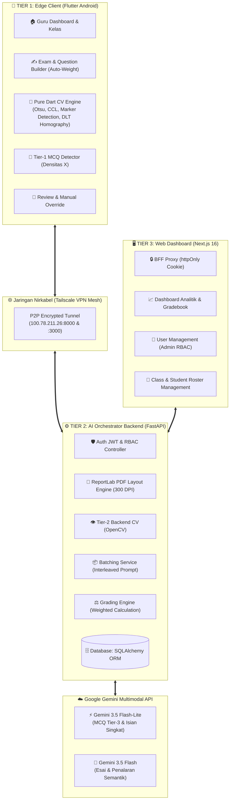

# 🏛️ 01 — Arsitektur & Desain Sistem

Dokumen ini mendefinisikan prinsip desain arsitektural, topologi jaringan, pemisahan tanggung jawab (*separation of concerns*), dan keputusan teknis inti pada sistem **AutoGrading**.

---

## 1. Topologi Global (3-Tier Hybrid)

Sistem AutoGrading mengadopsi pola **Edge Computer Vision + Cloud Multimodal AI Orchestration**:



---

## 2. Prinsip Desain Non-Negotiable

1. **Separation of Concerns (Kemandirian Layer):**
   - Aplikasi Mobile dan Web Frontend **tidak pernah mengakses database secara langsung**. Seluruh transaksi data berjalan melalui REST API FastAPI yang terotentikasi.
2. **Keamanan Kredensial & Zero-Leakage:**
   - Kunci API Gemini (`GEMINI_API_KEY`) dan rahasia enkripsi JWT (`JWT_SECRET`) **hanya tersimpan di file `backend/.env`**. Tidak ada kredensial sensitif yang dikompilasi ke APK mobile atau JavaScript web client.
   - Web Dashboard menggunakan pola **BFF (Backend-For-Frontend)** dengan *httpOnly Secure Cookie*, sehingga token JWT tidak dapat diakses oleh skrip berbahaya di sisi klien (*XSS Protection*).
3. **Optimasi Muatan (*Payload Optimization*):**
   - Perangkat mobile **tidak pernah mengunggah foto lembar A4 utuh** (yang berukuran 4–8 MB).
   - Melalui *Edge Computer Vision*, aplikasi mobile melakukan pemotongan (*crop*) per kotak jawaban, dikompresi menjadi format JPEG q70 ($\le 768\text{ px}$, ukuran $\sim 50\text{--}100\text{ KB}$ per kotak).
4. **Strict JSON Schema Enforcement:**
   - Seluruh respons dari model AI Gemini divalidasi dan dipaksa (*enforced*) menggunakan `response_schema` struktural (bukan sekadar instruksi teks bebas), menjamin stabilitas parsing JSON.
5. **Grading Hybrid & Cost-Efficiency:**
   - Soal Pilihan Ganda (MCQ) dinilai terlebih dahulu menggunakan Computer Vision lokal gratis ($0\text{ RPD}$), menghemat kuota AI hingga 80%.

---

## 3. Matriks Keputusan Stack Teknologi

| Komponen | Pilihan Teknologi | Rationale & Justifikasi |
|---|---|---|
| **Mobile Client** | **Flutter 3 (Dart)** | Performa tinggi, cross-platform Android native, kapabilitas pemrosesan citra murni *Pure Dart* tanpa dependensi C++ eksternal yang rentan rusak pada toolchain Android modern. |
| **Backend API** | **FastAPI (Python 3.14+)** | Asynchronous I/O berkecepatan tinggi, validasi skema otomatis berbasis Pydantic v2, dokumentasi interaktif bawaan Swagger (`/docs`), dan integrasi alami dengan ekosistem AI Google GenAI. |
| **Database ORM** | **SQLAlchemy 2.0** | Abstraksi database penuh. Memungkinkan perpindahan tanpa hambatan antara SQLite (dev/testing), MySQL/phpMyAdmin (server lokal sekolah), dan PostgreSQL (produksi cloud). |
| **Web Dashboard** | **Next.js 16 (App Router)** | Rendering performan, Turbopack bundling cepat, arsitektur BFF Proxy bawaan, serta komponen analitik data berbasis Tailwind CSS & Chart.js. |
| **Multimodal AI** | **Google Gemini 3.5 API** | Pemahaman tulisan tangan (*Handwriting Recognition* / HWR) Bahasa Indonesia terbaik, penalaran semantik kontekstual untuk jawaban esai, dan dukungan *interleaved multimodal batching*. |

---

## 4. Analisis & Routing Model AI (Fase Produksi)

Berdasarkan hasil benchmark komprehensif pada dataset tulisan tangan dan lembar jawaban sintetis:

```
                  ┌───────── Tipe Soal: MCQ ─────────┐
                  ▼                                  ▼
           [Jawaban Jelas]                    [Tanda Ambigu / Kotor]
                  │                                  │
         (1) Edge Dart CV                   (2) Backend OpenCV
       [model_used: mobile-cv]             [model_used: cv-mcq]
                  │                                  │
                  └─────────► [Tetap Ambigu] ────────┘
                                     │
                                     ▼
                            (3) Gemini 3.5 Flash-Lite
                            [model_used: gemini-3.5-flash-lite]

         ┌─────────────── Tipe Soal: Isian Singkat ───────────────┐
         ▼                                                        ▼
   Gemini 3.5 Flash-Lite                                   Gemini 3.5 Flash
(Batch 10, HWR + Semantic)                            (Esai Kompleks & Penalaran)
```

| Tugas / Tipe Soal | Model yang Digunakan | Karakteristik & Quota | Catatan Operasional |
|---|---|---|---|
| **MCQ (Tier 1 & 2)** | **Pure Dart / OpenCV** | $0\text{ RPD}$ (Gratis, $0\text{ ms}$) | Mendeteksi posisi tanda silang (X) pada kotak a/b/c/d. |
| **MCQ (Tier 3)** | `gemini-3.5-flash-lite` | $200\text{ RPD}$ / $30\text{ RPM}$ | Fallback otomatis jika tanda silang ambigu. |
| **Isian Singkat** | `gemini-3.5-flash-lite` | $200\text{ RPD}$ / $30\text{ RPM}$ | HWR cepat + pencocokan sinonim kata kunci. |
| **Esai / Uraian** | `gemini-3.5-flash` | $20\text{ RPD}$ / $5\text{ RPM}$ | Evaluasi pemahaman konsep mendalam & rubrik. |
| **Fallback Rate Limit** | `gemini-3.5-flash-lite` | Kuota terpisah | Otomatis aktif saat model Flash utama mencapai ambang 429. |
| **Offline Dev / Mock** | `MockGeminiClient` | $0\text{ RPD}$ (Offline murni) | Aktif jika `GEMINI_MOCK_MODE=true` atau API key kosong (skor deterministik 85/45). |
