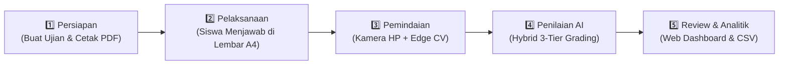
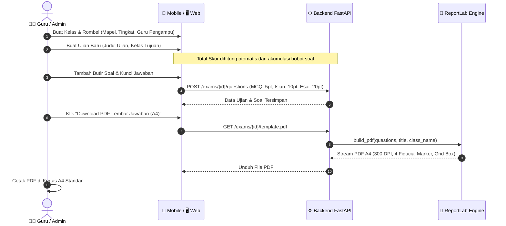
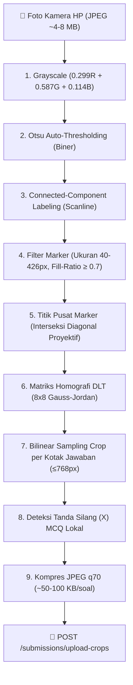
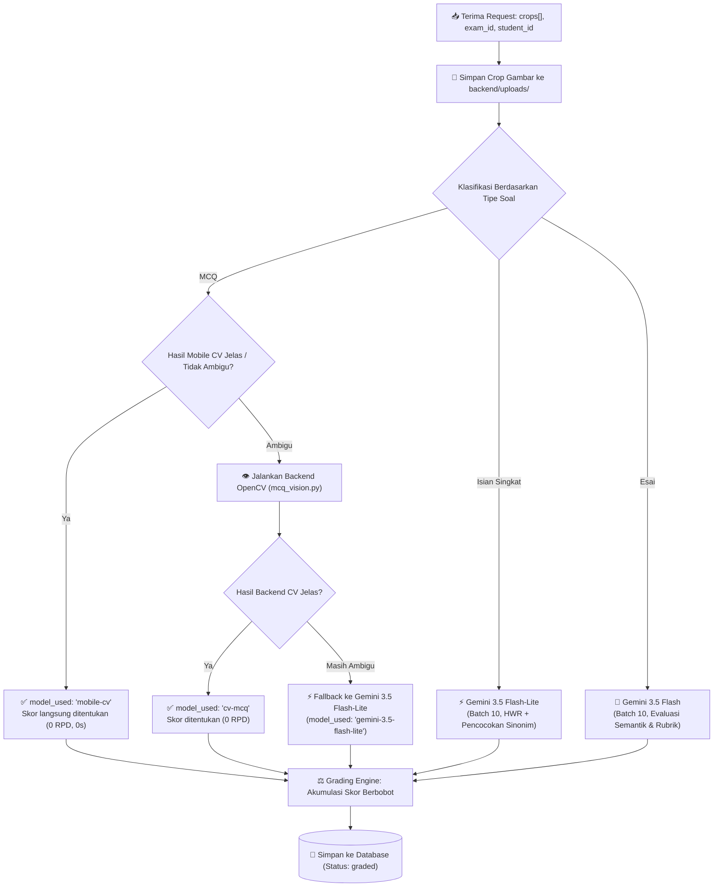

# 🔄 02 — Alur Kerja Sistem Komprehensif

Dokumen ini memuat panduan operasional dan alur kerja (*end-to-end workflow*) sistem **AutoGrading** dari tahap pembuatan soal, pencetakan lembar ujian, pemindaian kamera, penilaian AI, hingga pelaporan analitik.

---

## 🧭 Ringkasan 5 Tahapan Alur Kerja

---

## 🟢 TAHAP 1: Persiapan Ujian, Penyusunan Soal & Template PDF

### Standar Penulisan Kunci Jawaban (`answer_key`):
* **Pilihan Ganda (MCQ):** Pilih opsi benar (`A`, `B`, `C`, atau `D`).
* **Isian Singkat:** Tuliskan kata kunci benar. Tambahkan variasi sinonim/rumus setara menggunakan pemisah pipa `|` (contoh: `fotosintesis | proses pembuatan makanan pada tumbuhan` atau `teorema Pythagoras | a^2+b^2=c^2`).
* **Esai / Uraian:** Tuliskan gagasan utama / rubrik konsep kunci yang wajib dinilai oleh AI semantik.

---

## 📝 TAHAP 2: Pelaksanaan & Pengisian Jawaban oleh Siswa

1. Siswa mengisi identitas diri (Nama, Kelas, No. Absen, Tanggal) pada bagian kop lembar jawaban A4.
2. **Aturan Pengisian Kotak:**
   * **Pilihan Ganda:** Siswa memberikan **tanda silang (X)** pada salah satu kotak opsi (`a`, `b`, `c`, atau `d`).
   * **Isian & Esai:** Siswa menuliskan teks jawaban menggunakan pulpen/pensil di dalam kotak bernomor.
3. Kertas lembar jawaban dikumpulkan setelah ujian selesai.

---

## 📷 TAHAP 3: Pemindaian Kamera & *Edge Computer Vision* (Mobile)

Seluruh deteksi geometris dan pemotongan gambar dilakukan **secara lokal di HP Android (Pure Dart)** tanpa mengirim foto utuh ke server:

### Keunggulan Edge CV Pure Dart:
* **Projective-Invariant Marker Detection:** Menghitung pusat marker dari titik potong diagonal kontur ekstrem, sehingga deteksi tetap presisi meskipun kertas difoto dengan kemiringan perspektif sudut tertentu.
* **Bilinear Sampling Per Sel:** Aplikasi langsung memotong kotak jawaban dari matriks transformasi tanpa perlu merender ulang halaman A4 penuh, menghemat penggunaan RAM ponsel.
* **Hemat Bandwidth:** Hanya potongan kotak jawaban yang dikirim ke server via jaringan nirkabel.

---

## 🧠 TAHAP 4: Penilaian Hybrid & Koreksi AI (Backend)

Backend menerima muatan crop jawaban dan mengevaluasi hasil secara paralel:

---

## 📊 TAHAP 5: Review, Finalisasi & Analitik Asesmen (Web & Mobile)

1. **Review & Manual Override:**
   * Guru dapat melihat transkripsi teks hasil HWR AI, alasan penilaian (*AI reasoning*), dan tingkat keyakinan (*confidence score*).
   * Guru dapat mengubah nilai (*manual override*) menggunakan slider nilai tanpa perlu memanggil ulang AI.
2. **Finalisasi Nilai:**
   * Guru menekan tombol **Finalize** untuk mengunci nilai siswa.
3. **Analitik Asesmen di Web Dashboard:**
   * **KPI Overview:** Rata-rata kelas, tingkat kelulusan, nilai tertinggi/terendah.
   * **Distribusi Nilai:** Histogram sebaran nilai siswa (interval 10 poin).
   * **Analisis Butir Soal (Item Difficulty):** Indikator warna lampu lalu lintas (🟢 Mudah $>80\%$, 🟡 Sedang $40\text{--}80\%$, 🔴 Sulit $<40\%$).
   * **Ekspor Laporan:** Unduh rekap nilai format CSV siap pakai untuk penginputan e-Rapor sekolah.
