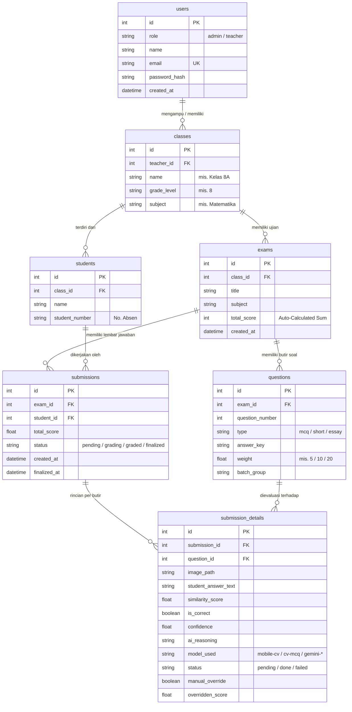

# 🗄️ 04 — Skema Database & SQLAlchemy ORM

Dokumen ini mendokumentasikan skema database relasional, definisi tabel, hubungan kunci asing (*foreign keys*), relasi penghapusan berkaskade (*cascade delete*), dan pemetaan ORM pada sistem **AutoGrading**.

---

## 1. Diagram Relasi Entitas (ERD)

---

## 2. Rincian Kamus Data Tabel

### Tabel `users`
| Kolom | Tipe Data | Nullable | Keterangan |
|---|---|:---:|---|
| `id` | `INTEGER` (PK) | ❌ | Primary Key otomatis. |
| `role` | `VARCHAR(32)` | ❌ | Peran akun: `admin` (Administrator) atau `teacher` (Guru Pengampu). |
| `name` | `VARCHAR(128)` | ❌ | Nama lengkap pengguna beserta gelar. |
| `email` | `VARCHAR(128)` | ❌ | Email unik untuk login sistem. |
| `password_hash` | `VARCHAR(256)` | ❌ | Hash kata sandi menggunakan algoritma `bcrypt`. |
| `created_at` | `DATETIME` | ❌ | Timestamp pembuatan akun. |

### Tabel `classes`
| Kolom | Tipe Data | Nullable | Keterangan |
|---|---|:---:|---|
| `id` | `INTEGER` (PK) | ❌ | Primary Key kelas / rombongan belajar. |
| `teacher_id` | `INTEGER` (FK) | ❌ | Terikat ke `users.id` guru pengampu kelas. |
| `name` | `VARCHAR(64)` | ❌ | Nama rombel (misal: `"8A"`, `"9B"`). |
| `grade_level` | `VARCHAR(32)` | ❌ | Tingkat pendidikan (misal: `"8"`). |
| `subject` | `VARCHAR(128)` | ❌ | Mata pelajaran kurikulum (misal: `"Matematika"`, `"IPA"`). |

### Tabel `students`
| Kolom | Tipe Data | Nullable | Keterangan |
|---|---|:---:|---|
| `id` | `INTEGER` (PK) | ❌ | Primary Key siswa. |
| `class_id` | `INTEGER` (FK) | ❌ | Terikat ke `classes.id`. *Cascade Delete*. |
| `name` | `VARCHAR(128)` | ❌ | Nama lengkap siswa. |
| `student_number` | `VARCHAR(32)` | ❌ | Nomor absen siswa (dicetak pada LJK). |

### Tabel `exams`
| Kolom | Tipe Data | Nullable | Keterangan |
|---|---|:---:|---|
| `id` | `INTEGER` (PK) | ❌ | Primary Key ujian. |
| `class_id` | `INTEGER` (FK) | ❌ | Terikat ke `classes.id`. *Cascade Delete*. |
| `title` | `VARCHAR(128)` | ❌ | Judul ujian (misal: `"UTS Aljabar Genap"`). |
| `subject` | `VARCHAR(128)` | ❌ | Mata pelajaran ujian. |
| `total_score` | `INTEGER` | ❌ | Akumulasi total skor (dihitung otomatis dari $\sum \text{weight}$ butir soal). |
| `created_at` | `DATETIME` | ❌ | Waktu pembuatan ujian. |

### Tabel `questions`
| Kolom | Tipe Data | Nullable | Keterangan |
|---|---|:---:|---|
| `id` | `INTEGER` (PK) | ❌ | Primary Key butir soal. |
| `exam_id` | `INTEGER` (FK) | ❌ | Terikat ke `exams.id`. *Cascade Delete*. |
| `question_number` | `INTEGER` | ❌ | Nomor urut soal ($1, 2, 3, \dots, N$). |
| `type` | `VARCHAR(16)` | ❌ | Tipe butir soal: `mcq`, `short`, atau `essay`. |
| `answer_key` | `TEXT` | ❌ | Kunci jawaban acuan (alternatif dipisah dengan `|`). |
| `weight` | `FLOAT` | ❌ | Bobot nilai butir soal (default: MCQ=5, Short=10, Essay=20). |
| `batch_group` | `VARCHAR(16)` | ✅ | Penandaan grup eksekusi AI runtime (`lite` / `flash`). |

### Tabel `submissions`
| Kolom | Tipe Data | Nullable | Keterangan |
|---|---|:---:|---|
| `id` | `INTEGER` (PK) | ❌ | Primary Key lembar jawaban siswa. |
| `exam_id` | `INTEGER` (FK) | ❌ | Terikat ke `exams.id`. |
| `student_id` | `INTEGER` (FK) | ❌ | Terikat ke `students.id`. |
| `total_score` | `FLOAT` | ✅ | Nilai akhir ujian siswa setelah evaluasi AI & override. |
| `status` | `VARCHAR(16)` | ❌ | Status pengerjaan: `pending`, `grading`, `graded`, `finalized`. |
| `created_at` | `DATETIME` | ❌ | Waktu pemindaian lembar jawaban. |
| `finalized_at` | `DATETIME` | ✅ | Waktu penguncian nilai oleh guru. |

### Tabel `submission_details`
| Kolom | Tipe Data | Nullable | Keterangan |
|---|---|:---:|---|
| `id` | `INTEGER` (PK) | ❌ | Primary Key rincian jawaban per butir. |
| `submission_id` | `INTEGER` (FK) | ❌ | Terikat ke `submissions.id`. *Cascade Delete*. |
| `question_id` | `INTEGER` (FK) | ❌ | Terikat ke `questions.id`. |
| `image_path` | `VARCHAR(256)` | ❌ | Lokasi file gambar potongan kotak jawaban tersimpan di server. |
| `student_answer_text` | `TEXT` | ✅ | Teks transkripsi hasil pembacaan AI (*HWR*). |
| `similarity_score` | `FLOAT` | ✅ | Skor kemiripan semantik terhadap kunci ($0\text{--}100$). |
| `is_correct` | `BOOLEAN` | ✅ | `true` jika skor $\ge \text{threshold}$ ($70$), `false` jika sebaliknya. |
| `confidence` | `FLOAT` | ✅ | Tingkat keyakinan model AI ($0.0\text{--}1.0$). |
| `ai_reasoning` | `TEXT` | ✅ | Penjelasan penalaran penilaian dari model AI. |
| `model_used` | `VARCHAR(32)` | ✅ | Penanda mesin penilai: `mobile-cv`, `cv-mcq`, atau nama model Gemini. |
| `status` | `VARCHAR(16)` | ❌ | Status per butir: `pending`, `done`, atau `failed`. |
| `manual_override` | `BOOLEAN` | ❌ | Penanda apakah nilai telah diubah manual oleh guru (`false` default). |
| `overridden_score` | `FLOAT` | ✅ | Nilai pengganti hasil intervensi manual guru. |
