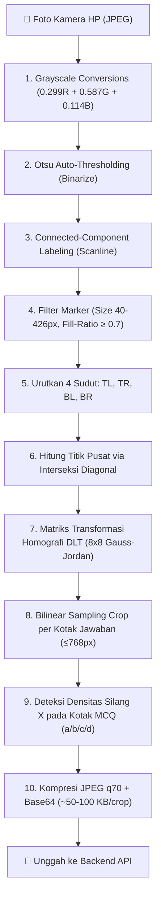

# 📱 07 — Spesifikasi Aplikasi Mobile (Flutter Android)

Dokumen ini mendokumentasikan arsitektur aplikasi mobile Android **AutoGrading Scanner**, pipeline pemrosesan citra *Edge Pure Dart*, dan alur antarmuka pengguna (*UI Workflow*).

---

## 🏗️ 1. Arsitektur & Struktur Direktori

Aplikasi mobile dibangun menggunakan **Flutter 3** dengan arsitektur modular:

```
mobile/
├── lib/
│   ├── main.dart                    # Entry point, routing, auth guard
│   ├── core/
│   │   ├── api_client.dart          # HTTP client (Dio), JWT auth, interceptor
│   │   ├── config.dart              # Konfigurasi runtime (API_BASE)
│   │   ├── template_constants.dart  # Konstanta geometri A4 & koordinat marker
│   │   └── opencv_pipeline.dart     # Pipeline Edge CV murni Dart (Pure Dart)
│   └── features/
│       ├── auth/login_page.dart     # Form login guru & konfigurasi server
│       ├── classes/classes_page.dart # Daftar kelas yang diampu guru
│       ├── exams/exams_page.dart    # Daftar ujian aktif & progres koreksi
│       ├── exams/exam_editor_page.dart # Exam & Question builder berbobot otomatis
│       ├── scanning/scan_page.dart  # Kamera scanner, multi-page, crop upload
│       └── review/review_page.dart  # In-app review, manual override, finalize
├── test/
│   ├── mcq_detection_test.dart      # Pengujian deteksi tanda silang (X)
│   └── opencv_pipeline_test.dart    # Pengujian deteksi marker, homografi, & crop
└── android/                         # Toolchain Android (API 24+, compileSdk 37)
```

---

## ⚡ 2. Pipeline Pemrosesan Citra Edge (Pure Dart)

Untuk memastikan kompatibilitas jangka panjang tanpa dependensi C++ biner eksternal, seluruh algoritma Computer Vision ditulis dalam **Dart murni (`package:image`)**:



### Deteksi Opsi Silang Lokal (`McqMark`):
```dart
class McqMark {
  final String answer;     // Opsi terdeteksi: "a", "b", "c", atau "d"
  final double confidence; // Densitas piksel tinta pada kotak terpilih
  final bool ambiguous;    // True jika densitas < 0.03 atau kontras < 1.5x
}
```
* **Kompensasi Perspektif:** Algoritma membaca fraksi koordinat kotak tetap (`MCQ_BOX_FRACTIONS: a=[0.0263, 0.2105], b=[0.2895, 0.4737], c=[0.5526, 0.7368], d=[0.8158, 1.0000]`) langsung dari citra cell yang sudah di-warp.
* **Handover Cerdas:** Nilai `answer` dan `ambiguous` dikirim dalam payload `UploadCropsRequest` (`mcq_answer` & `mcq_ambiguous`) sehingga backend tidak perlu memanggil AI jika tanda silang sudah jelas terdeteksi di ponsel.

---

## ✍️ 3. Fitur Exam & Question Builder

* **Hapus Input Manual Total Skor:** Guru tidak lagi perlu menginput total skor ujian di awal.
* **Default Bobot Standar:**
  - 🔘 **Pilihan Ganda (MCQ):** Default = **`5` pt**
  - ✏️ **Isian Singkat (Short Answer):** Default = **`10` pt**
  - 📄 **Esai / Uraian (Essay):** Default = **`20` pt**
* **Banner Real-time:** Menampilkan perolehan total skor secara langsung:
  `Total Skor: X pt (Akumulasi Y Butir Soal)`.
* **Download PDF Instan:** Tombol langsung untuk mengunduh lembar jawaban A4 dari aplikasi.

---

## 📷 4. Alur Pemindaian Multi-Halaman & Review Nilai

1. **Pemilihan Siswa:** Guru memilih nama atau nomor absen siswa dari daftar hadir kelas.
2. **Kamera Bidik Cepat:** Guru mengarahkan kamera ke lembar jawaban A4 (layar menampilkan panduan 4 sudut).
3. **Deteksi Multi-Halaman:** Jika ujian terdiri dari 2 halaman, sistem meminta foto halaman ke-2 sebelum melakukan kompilasi kiriman.
4. **Halaman Review & Manual Override:**
   - Polling status grading setiap 3 detik.
   - Menampilkan gambar potongan crop, teks hasil AI, skor per butir, dan alasan penilaian.
   - Slider interaktif untuk mengubah nilai secara manual (*override*).
   - Tombol **Simpan & Finalisasi** untuk mengunci skor.

## 📦 5. Kompilasi & Build APK Android (Optimasi Ukuran File)

Ukuran file APK bervariasi bergantung pada target mode kompilasi:

| Mode Build | Perintah Kompilasi | Ukuran File | Kegunaan |
|---|---|:---:|---|
| **Release (Split ABI - Paling Ramping ⭐)** | `flutter build apk --release --split-per-abi --dart-define=API_BASE=https://...` | **~18 MB** | Distribusi ke HP Android modern (`arm64-v8a`). |
| **Release (Universal)** | `flutter build apk --release --dart-define=API_BASE=https://...` | **~45 MB** | 1 File APK universal untuk semua tipe arsitektur CPU. |
| **Debug (Fat Binary)** | `flutter build apk --debug --dart-define=API_BASE=http://...` | **~158 MB** | Khusus pengembangan lokal (memuat Dart JIT Compiler + 4 ABI uncompressed). |

### Perintah Kompilasi Produksi yang Direkomendasikan:
```powershell
cd mobile
# Kompilasi rilis ramping per arsitektur CPU (arm64-v8a: ~18 MB)
flutter build apk --release --split-per-abi --dart-define=API_BASE=https://autograding-api.onrender.com
```

*File APK yang dihasilkan:*
* **HP Android Modern (64-bit):** `mobile/build/app/outputs/flutter-apk/app-arm64-v8a-release.apk` (**~18 MB**)
* **HP Android Lama (32-bit):** `mobile/build/app/outputs/flutter-apk/app-armeabi-v7a-release.apk` (**~16 MB**)
* **Emulator PC (x86_64):** `mobile/build/app/outputs/flutter-apk/app-x86_64-release.apk` (**~20 MB**)
