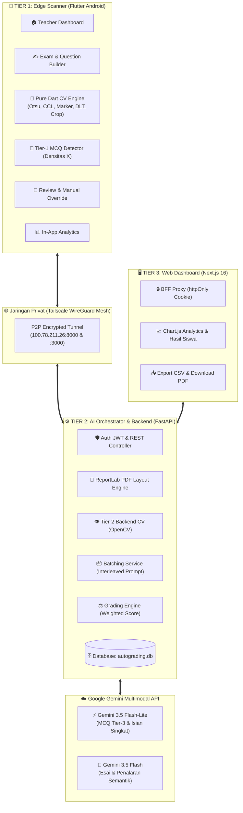
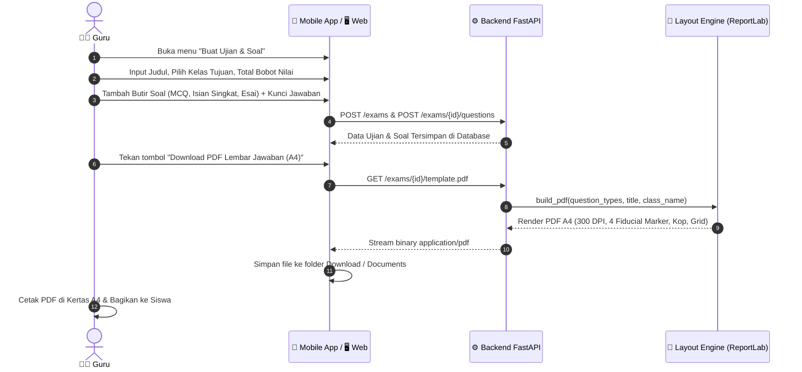
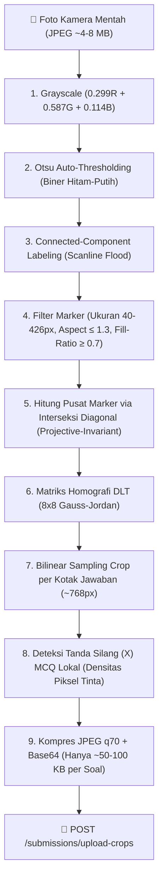
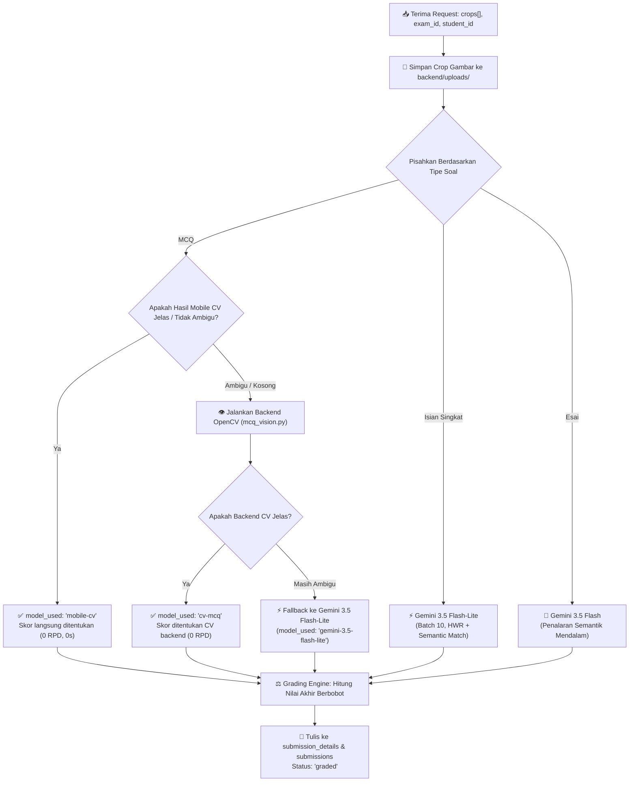
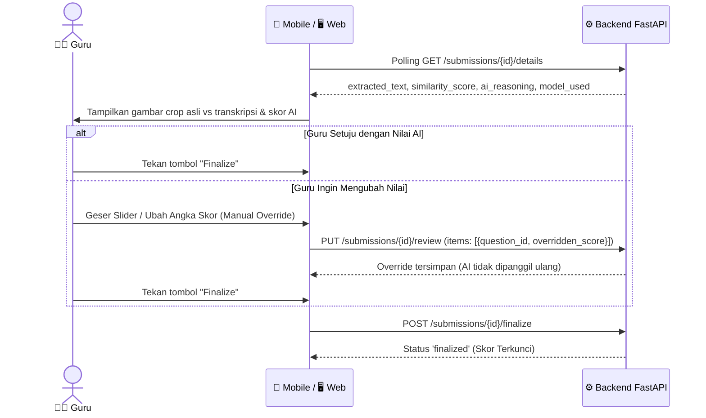
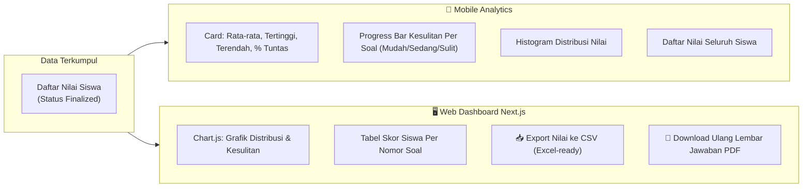

# 🔄 Alur Kerja Sistem Komprehensif — AutoGrading (Vision-NLP Hybrid)

Dokumen ini adalah referensi teknis dan operasional lengkap yang mendokumentasikan **seluruh arsitektur, pipeline pemrosesan, dan alur kerja (workflow) end-to-end** sistem AutoGrading dari pembuatan soal hingga pelaporan analitik.

---

## 🏗️ 1. Arsitektur Global & Topologi Sistem

Sistem AutoGrading mengadopsi arsitektur **3-Tier Hybrid (Edge Computer Vision + Cloud Multimodal AI)** yang terhubung secara nirkabel melalui mesh network **Tailscale**:

---

## 📋 2. Alur Kerja End-to-End

---

### 🟢 ALUR 1: Pembuatan Ujian, Soal & Download Template PDF

#### Spesifikasi Kunci Jawaban:
* **Pilihan Ganda (MCQ):** Guru memilih opsi kunci benar (`A`, `B`, `C`, atau `D`).
* **Isian Singkat:** Guru memasukkan jawaban benar dan dapat menambahkan alternatif sinonim/variasi format rumus menggunakan tanda `|` (misal: `fotosintesis | proses pembuatan makanan pada tumbuhan` atau `teorema Pythagoras | a^2+b^2=c^2`).
* **Esai:** Guru memasukkan gagasan pokok/rubrik konsep utama yang wajib dinilai oleh AI semantik.

#### Spesifikasi Geometri PDF Lembar Jawaban (`template_service.py`):
* **Ukuran:** A4 Portrait ($210 \times 297\text{ mm}$, render 300 DPI = $2480 \times 3508\text{ px}$).
* **4 Fiducial Marker:** Kotak hitam pekat $12 \times 12\text{ mm}$ dicetak di 4 sudut halaman (pusat koordinat $(18, 18)\text{ mm}$).
* **Grid Jawaban:**
  * **MCQ:** Baris 4 kotak opsi a/b/c/d ($14 \times 16\text{ mm}$, gap $6\text{ mm}$, total lebar $76\text{ mm}$).
  * **Isian:** Kotak $100 \times 18\text{ mm}$.
  * **Esai:** Kotak $170 \times 50\text{ mm}$ (margin aman dari tepi cetak).

---

### 📝 ALUR 2: Pelaksanaan & Pengisian Jawaban oleh Siswa

1. Siswa menuliskan identitas (Nama, Kelas, No. Absen, Tanggal) di kolom identitas bagian atas lembar A4.
2. **Aturan Pengisian Jawaban:**
   * **MCQ:** Siswa memberikan **tanda silang (X)** pada salah satu kotak opsi (a/b/c/d).
   * **Isian & Esai:** Siswa menuliskan jawaban tulisan tangan biasa di dalam kotak bernomor.

---

### 📷 ALUR 3: Pemindaian Kamera & *Edge CV Pipeline* (Mobile)

Seluruh pemrosesan gambar awal dilakukan **100% lokal di HP Android (Pure Dart CV)** tanpa mengirim foto utuh ke server:

#### Keunggulan Algoritma Edge CV:
1. **Projective-Invariant Marker Detection:** Menghitung pusat marker dari titik perpotongan diagonal kontur ekstrem (bukan centroid momen standar), sehingga deteksi tetap presisi meskipun kertas difoto miring.
2. **Bilinear Sampling Per Sel:** Aplikasi tidak membebani RAM dengan men-transform seluruh halaman A4, melainkan langsung memotong kotak jawaban dari matriks homografi.
3. **Payload Ringan:** HP hanya mengirim potongan jawaban (~50–100 KB), menghemat bandwidth internet dan kuota data.

---

### 🧠 ALUR 4: AI Orchestration & Penilaian Hybrid (Backend)

Backend menerima request crop jawaban, menyimpannya di folder `backend/uploads/`, dan menjalankan evaluasi otomatis:

#### 1. Mekanisme 3-Tier Soal Pilihan Ganda (MCQ):
* **Tier-1 (Mobile CV):** Menghitung densitas tinta pada 4 kotak opsi (a/b/c/d). Jika kotak tergelap memiliki densitas $\ge 0.03$ dan $\ge 1.5\times$ kotak kedua $\rightarrow$ Opsi langsung diputuskan di HP (**0 detik, 0 kuota AI**).
* **Tier-2 (Backend CV):** Jika data mobile ambigu $\rightarrow$ Backend menjalankan analisis kontur OpenCV.
* **Tier-3 (Gemini AI Fallback):** Jika siswa mencoret-coret lembar atau gambar kotor $\rightarrow$ Dikirim ke Gemini Flash-Lite.

#### 2. Single-Pass Multimodal (HWR + Semantic Evaluation):
Gemini melakukan **dua tugas sekaligus dalam satu kali panggilan**:
* **Transkripsi Tulisan Tangan:** Membaca tulisan tangan siswa bahasa Indonesia $\rightarrow$ `extracted_text`.
* **Evaluasi Semantik:** Menilai kesesuaian makna terhadap kunci jawaban guru $\rightarrow$ `similarity_score` ($0 - 100$), `is_correct` ($\ge 70$), dan `reason` (alasan penilaian).
* **Ekuivalensi Rumus Matematika:** Prompt AI telah diinstruksikan bahwa rumus/notasi matematika bernilai setara dengan nama konsepnya (misal: jawaban $a^2+b^2=c^2$ otomatis dinilai 100/benar untuk kunci "Teorema Pythagoras").

---

### ✍️ ALUR 5: Review Guru & Manual Override

---

### 📊 ALUR 6: Dashboard Analitik & Ekspor Laporan

Setelah seluruh lembar jawaban ujian terkoreksi, data disajikan dalam berbagai bentuk visual:

---

## 🛡️ 3. Keamanan & Infrastruktur Jaringan

| Aspek | Implementasi Teknis | Keuntungan |
|---|---|---|
| **Koneksi Nirkabel** | **Tailscale WireGuard Mesh** (`100.78.211.26`) | HP dan PC terhubung nirkabel melintasi router/WiFi/4G apa pun dengan enkripsi P2P layer-3 tanpa perlu port forwarding publik. |
| **Proteksi AI Secrets** | Gemini API Key hanya berada di `backend/.env` | File APK dan frontend Web bersih dari kredensial cloud (**0% risiko kebocoran key**). |
| **Otentikasi Web** | **BFF Proxy + httpOnly Cookie** (`ag_token`) | Token JWT tidak pernah dapat diakses oleh skrip JavaScript di browser (kebal serangan XSS). |
| **Penyimpanan Mobile** | `FlutterSecureStorage` (Android Keystore AES-GCM) | Token login di HP terlindungi di level hardware keystore OS. |

---

## 📁 4. Pemetaan File & Komponen Terkait

* **Mobile App:**
  * Beranda Guru: [`mobile/lib/features/dashboard/teacher_dashboard_page.dart`](file:///C:/coding/geprekkumlot_hologyUB2026/mobile/lib/features/dashboard/teacher_dashboard_page.dart)
  * Pembuat Soal & Kunci: [`mobile/lib/features/exams/exam_editor_page.dart`](file:///C:/coding/geprekkumlot_hologyUB2026/mobile/lib/features/exams/exam_editor_page.dart)
  * Pipeline Scanner (CV): [`mobile/lib/core/opencv_pipeline.dart`](file:///C:/coding/geprekkumlot_hologyUB2026/mobile/lib/core/opencv_pipeline.dart)
  * Analitik Mobile: [`mobile/lib/features/analytics/exam_analytics_page.dart`](file:///C:/coding/geprekkumlot_hologyUB2026/mobile/lib/features/analytics/exam_analytics_page.dart)
* **Backend:**
  * Template Layout Generator: [`backend/app/services/template_service.py`](file:///C:/coding/geprekkumlot_hologyUB2026/backend/app/services/template_service.py)
  * Integrasi Gemini & Batching: [`backend/app/services/gemini_client.py`](file:///C:/coding/geprekkumlot_hologyUB2026/backend/app/services/gemini_client.py) & [`batching_service.py`](file:///C:/coding/geprekkumlot_hologyUB2026/backend/app/services/batching_service.py)
  * Evaluasi CV Backend MCQ: [`backend/app/services/mcq_vision.py`](file:///C:/coding/geprekkumlot_hologyUB2026/backend/app/services/mcq_vision.py)
* **Web Dashboard:**
  * Halaman Detail Ujian & Analitik: [`web/app/dashboard/exams/[id]/page.tsx`](file:///C:/coding/geprekkumlot_hologyUB2026/web/app/dashboard/exams/[id]/page.tsx)
  * Login & BFF Proxy: [`web/app/login/page.tsx`](file:///C:/coding/geprekkumlot_hologyUB2026/web/app/login/page.tsx) & [`web/app/api/auth/login/route.ts`](file:///C:/coding/geprekkumlot_hologyUB2026/web/app/api/auth/login/route.ts)
