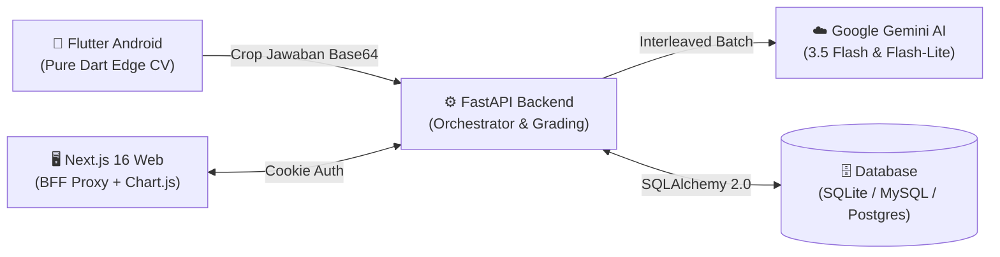

# 📚 Dokumentasi Resmi — AutoGrading (Vidyanetra)
### *Sistem Asesmen & Koreksi Ujian Otomatis (Edge CV + Multimodal AI)*

🌐 **Live Web Dashboard:** [https://vidyanetra.vercel.app](https://vidyanetra.vercel.app)

Selamat datang di repositori dokumentasi resmi sistem **AutoGrading (Vidyanetra)**. Sistem ini menggabungkan teknologi **Edge Computer Vision (Pure Dart)** pada perangkat mobile Android, **Backend API Orchestrator (FastAPI)**, **Multimodal AI (Google Gemini)**, dan **Web Dashboard Analitik (Next.js 16)** untuk menyediakan solusi koreksi lembar jawaban ujian tulisan tangan secara akurat, cepat, dan hemat kuota.

---

## 🧭 Daftar Isi & Peta Dokumentasi

Seluruh dokumentasi disusun secara modular, terstruktur, dan bebas redundansi:

| No | Dokumen | Fokus & Deskripsi Modul |
|:---:|---|---|
| **01** | [**Arsitektur & Desain Sistem**](01-arsitektur-dan-desain-sistem.md) | Topologi 3-Tier Global, prinsip arsitektur *non-negotiable*, perbandingan model AI, dan strategi optimasi muatan (*payload*). |
| **02** | [**Alur Kerja Sistem Komprehensif**](02-alur-kerja-komprehensif.md) | 5 Alur operasional *end-to-end* mulai dari pembuatan soal, pencetakan lembar A4, pemindaian kamera, penilaian hybrid AI, hingga analitik & ekspor. |
| **03** | [**Spesifikasi API Backend**](03-spesifikasi-api-backend.md) | Kontrak REST API FastAPI lengkap: Auth JWT, User Management (RBAC Admin), Kelas/Rombel, Roster Siswa, Ujian, Soal, Koreksi AI, dan Analitik. |
| **04** | [**Skema Database & ORM**](04-skema-database-dan-orm.md) | Diagram Relasi Entitas (ERD), skema tabel SQLAlchemy 2.0, relasi *cascade*, dan representasi data multi-role. |
| **05** | [**Integrasi Gemini AI & Computer Vision**](05-integrasi-ai-gemini-dan-cv.md) | Strategi penilaian hybrid 3-tier MCQ (Edge CV $\rightarrow$ Backend CV $\rightarrow$ Flash-Lite), *prompt engineering*, *interleaved batching*, dan mekanisme *fallback*. |
| **06** | [**Desain & Geometri Lembar Jawaban**](06-desain-dan-geometri-lembar-jawaban.md) | Spesifikasi PDF A4 (ReportLab 300 DPI), 4 *fiducial marker*, deteksi *projective-invariant*, transformasi homografi DLT, dan kontrak `layout.json`. |
| **07** | [**Spesifikasi Aplikasi Mobile**](07-spesifikasi-aplikasi-mobile.md) | Arsitektur Flutter Android, pipeline pemrosesan citra *Pure Dart*, penyusunan soal berbobot dinamis, alur *scan* multi-halaman, dan build APK. |
| **08** | [**Spesifikasi Web Dashboard**](08-spesifikasi-web-dashboard.md) | Next.js 16 (App Router + Turbopack), arsitektur BFF Proxy (httpOnly Cookie), visualisasi analitik asesmen, Manajemen Pengguna, dan Manajemen Kelas/Rombel. |
| **09** | [**Panduan Jaringan Nirkabel Tailscale**](09-panduan-jaringan-nirkabel-tailscale.md) | Prosedur koneksi nirkabel HP Android fisik ke server lokal PC melalui *mesh VPN* Tailscale tanpa kabel USB / `adb reverse`. |
| **10** | [**Panduan Database MySQL & phpMyAdmin**](10-panduan-database-mysql-phpmyadmin.md) | Langkah integrasi database MySQL / MariaDB (XAMPP / Laragon) dan pengelolaan skema via antarmuka web GUI phpMyAdmin. |
| **11** | [**Panduan Deployment Cloud Gratis**](11-panduan-deployment-cloud-gratis.md) | Panduan deployment 100% free tier (Supabase PostgreSQL + Koyeb/Render FastAPI + Vercel Next.js 16) dan log optimasi performa. |

---

## ⚡ Ringkasan Cepat Stack Teknologi

* **Mobile App:** Flutter 3 (Android API 24+), Pure Dart Image Processing, Secure Storage.
* **Backend:** FastAPI (Python 3.14+), SQLAlchemy 2.0 ORM, ReportLab PDF Engine, OpenCV Headless.
* **AI Engine:** Google Gemini SDK (`google.genai`), routing `gemini-3.5-flash` (esai) dan `gemini-3.5-flash-lite` (isian & fallback).
* **Web Dashboard:** Next.js 16, TypeScript, Tailwind CSS, Lucide Icons, Chart.js.
* **Database:** SQLite (default dev & testing) / MySQL 8+ & phpMyAdmin (XAMPP) / PostgreSQL (cloud).

---

## 🔑 Kredensial Akun Default (Hasil Seed)
| Peran (Role) | Email | Password | Akses Utama |
|---|---|---|---|
| **Administrator** | `admin@sekolah.id` | `admin123` | Web Dashboard (`/dashboard/users`, `/dashboard/classes`, `/dashboard`) |
| **Guru Pengampu** | `guru@sekolah.id` | `rahasia123` | Mobile Scanner App & Web Gradebook (`/dashboard`) |
